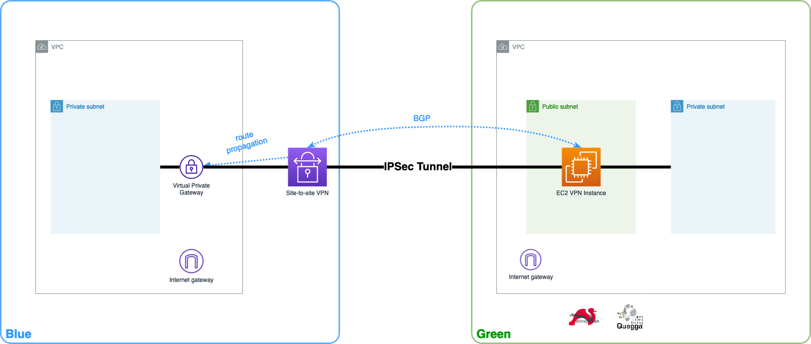

# A fully connected AWS site-to-site VPN with BGP

This module deploys all the resources needed for a fully functional AWS site-to-site connection, a service that connects privately your VPC to your remote networks. This is a common setup to connect your VPC to other cloud providers (Azure, Google Cloud, Oracle Cloud, ...) or to your self-hosted networks (home network, small business network, or a Data Center).

## Features
- A fully functional AWS site-to-site VPN connection
- A Customer Gateway (CGW) deployed in a EC2 instance, with IPSec and BGP protocols configured automatically.
- Licensed software is not used, you only pay for the AWS resources used.


## Architecture
This setup is divided in two logical sides, the blue side which is where your AWS resources are and a green side, with your external infrastructure, which will be represented here with a different VPC but it could be any infrastrucutre running the same software.




## Usage

Before deploy this module make sure you are authenticated in your AWS account [docs](https://registry.terraform.io/providers/hashicorp/aws/latest/docs#authentication-and-configuration).
### Basic setup
A fully functional VPN connection (no input variables needed)
```HCL
module "my_vpn_setup" {
    source  = "aws-terraform-fullyconnectedvpn"
    version = "1.0.0"

    # insert the 9 optional variables
}
```


<!-- BEGIN_TF_DOCS -->
## Requirements

| Name | Version |
|------|---------|
| <a name="requirement_terraform"></a> [terraform](#requirement\_terraform) | >= 1.0.11 |
| <a name="requirement_aws"></a> [aws](#requirement\_aws) | >= 4.5.0 |
| <a name="requirement_tls"></a> [tls](#requirement\_tls) | 3.1.0 |

## Providers

| Name | Version |
|------|---------|
| <a name="provider_aws"></a> [aws](#provider\_aws) | >= 4.5.0 |
| <a name="provider_tls"></a> [tls](#provider\_tls) | 3.1.0 |

## Modules

| Name | Source | Version |
|------|--------|---------|
| <a name="module_blue_vpc"></a> [blue\_vpc](#module\_blue\_vpc) | terraform-aws-modules/vpc/aws | 3.13.0 |
| <a name="module_green_vpc"></a> [green\_vpc](#module\_green\_vpc) | terraform-aws-modules/vpc/aws | 3.13.0 |

## Resources

| Name | Type |
|------|------|
| [aws_eip.green_vpn_inst](https://registry.terraform.io/providers/hashicorp/aws/latest/docs/resources/eip) | resource |
| [aws_eip_association.green_vpn_inst_eip](https://registry.terraform.io/providers/hashicorp/aws/latest/docs/resources/eip_association) | resource |
| [aws_instance.green_vpn_inst](https://registry.terraform.io/providers/hashicorp/aws/latest/docs/resources/instance) | resource |
| [aws_key_pair.green_vpn_inst](https://registry.terraform.io/providers/hashicorp/aws/latest/docs/resources/key_pair) | resource |
| [aws_route.green_blue_side_route](https://registry.terraform.io/providers/hashicorp/aws/latest/docs/resources/route) | resource |
| [aws_security_group.green_vpn_inst_green_traffic](https://registry.terraform.io/providers/hashicorp/aws/latest/docs/resources/security_group) | resource |
| [aws_security_group.green_vpn_inst_ipsec](https://registry.terraform.io/providers/hashicorp/aws/latest/docs/resources/security_group) | resource |
| [aws_security_group.green_vpn_inst_ssh](https://registry.terraform.io/providers/hashicorp/aws/latest/docs/resources/security_group) | resource |
| [aws_ssm_parameter.green_vpn_inst](https://registry.terraform.io/providers/hashicorp/aws/latest/docs/resources/ssm_parameter) | resource |
| [aws_vpn_connection.blue_vpn](https://registry.terraform.io/providers/hashicorp/aws/latest/docs/resources/vpn_connection) | resource |
| [tls_private_key.green_vpn_inst](https://registry.terraform.io/providers/hashicorp/tls/3.1.0/docs/resources/private_key) | resource |
| [aws_ami.green_vpn_inst_ubuntu](https://registry.terraform.io/providers/hashicorp/aws/latest/docs/data-sources/ami) | data source |
| [aws_availability_zones.available](https://registry.terraform.io/providers/hashicorp/aws/latest/docs/data-sources/availability_zones) | data source |

## Inputs

| Name | Description | Type | Default | Required |
|------|-------------|------|---------|:--------:|
| <a name="input_blue_asn"></a> [blue\_asn](#input\_blue\_asn) | (Optional) The BGP Autonomous System Number (ASN) for the blue side. Select an ASN from the private pool 64512 - 65534) | `string` | `"64620"` | no |
| <a name="input_blue_private_subnet_size"></a> [blue\_private\_subnet\_size](#input\_blue\_private\_subnet\_size) | (Optional) Private subnet size for the blue side. This size is a number that defines the subnet mask and can have any value from 16 to 28 as long as it is smaller than VPC size. We recommend to leave the default value If you have limited knowledge in subnetting. | `number` | `24` | no |
| <a name="input_blue_public_subnet_size"></a> [blue\_public\_subnet\_size](#input\_blue\_public\_subnet\_size) | (Optional) Public subnet size for the blue side. This size is a number that defines the subnet mask and can have any value from 16 to 28 as long as it is smaller than VPC size. We recommend to leave the default value If you have limited knowledge in subnetting. | `number` | `24` | no |
| <a name="input_blue_vpc_cidr"></a> [blue\_vpc\_cidr](#input\_blue\_vpc\_cidr) | (Optional) Blue side VPC CIDR. VPC size from /16 to /27. | `string` | `"10.1.0.0/16"` | no |
| <a name="input_green_asn"></a> [green\_asn](#input\_green\_asn) | (Optional) The BGP Autonomous System Number (ASN) for the green side. Select an ASN from the private pool 64512 - 65534) | `string` | `"65220"` | no |
| <a name="input_green_private_subnet_size"></a> [green\_private\_subnet\_size](#input\_green\_private\_subnet\_size) | (Optional) Private subnet size for the green side. This size is a number that defines the subnet mask and can have any value from 16 to 28 as long as it is smaller than VPC size. We recommend to leave the default value If you have limited knowledge in subnetting. | `number` | `24` | no |
| <a name="input_green_public_subnet_size"></a> [green\_public\_subnet\_size](#input\_green\_public\_subnet\_size) | (Optional) Public subnet size for the green side. This size is a number that defines the subnet mask and can have any value from 16 to 28 as long as it is smaller than VPC size. We recommend to leave the default value If you have limited knowledge in subnetting. | `number` | `24` | no |
| <a name="input_green_vpc_cidr"></a> [green\_vpc\_cidr](#input\_green\_vpc\_cidr) | (Optional) Green side VPC CIDR. VPC size from /16 to /27. | `string` | `"10.2.0.0/16"` | no |
| <a name="input_green_vpn_endpoint_instancetype"></a> [green\_vpn\_endpoint\_instancetype](#input\_green\_vpn\_endpoint\_instancetype) | (Optional) The instance type for the VPN EC2 instance used as Customer Gateway (CGW). Make sure you use an instance type that meets you requirements in network performance. | `string` | `"t3a.micro"` | no |
| <a name="input_green_vpn_inst_allowed_networks_ssh"></a> [green\_vpn\_inst\_allowed\_networks\_ssh](#input\_green\_vpn\_inst\_allowed\_networks\_ssh) | (Optional) Allowed networks (CIDR) to SSH to the VPN EC2 instance (green). Eg. 1. Use a single IP [1.1.1.1/32] 2. Use multple IP or networks [1.1.1.1/32, 10.0.1.0/24] | `list(any)` | `[]` | no |
| <a name="input_green_vpn_inst_keyname"></a> [green\_vpn\_inst\_keyname](#input\_green\_vpn\_inst\_keyname) | (Optional) Specify an existing key pair name to associate with the VPN EC2 instance in the green side. This key pair will be used for SSH authentication. If not specified, a new key pair will be created and the private key stored in parameter store. | `string` | `""` | no |
| <a name="input_project_tags"></a> [project\_tags](#input\_project\_tags) | (Optional) A map of convenient tags assigned to all resources. | `string` | `"https://registry.terraform.io/modules/bsrodrigs/fully-connected-vpn/aws/latest"` | no |
| <a name="input_region"></a> [region](#input\_region) | (Optional) AWS region where the module will be deployed (eg. eu-west-1). | `string` | `"eu-west-1"` | no |

## Outputs

| Name | Description |
|------|-------------|
| <a name="output_blue_vpc"></a> [blue\_vpc](#output\_blue\_vpc) | Blue side VPC outputs. For more details see official documentation https://registry.terraform.io/modules/terraform-aws-modules/vpc/aws/latest?tab=outputs |
| <a name="output_green_vpc"></a> [green\_vpc](#output\_green\_vpc) | Green side VPC outputs. For more details see official documentation https://registry.terraform.io/modules/terraform-aws-modules/vpc/aws/latest?tab=outputs |
<!-- END_TF_DOCS -->