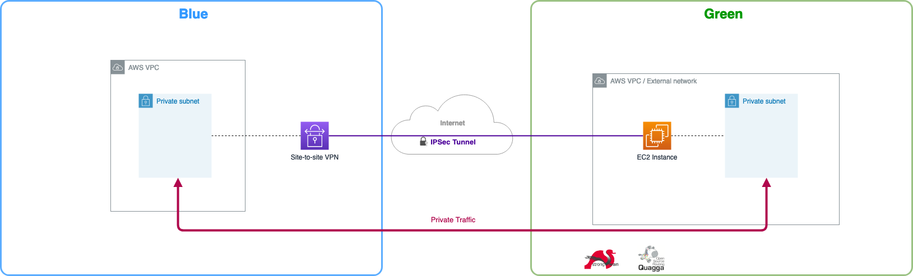
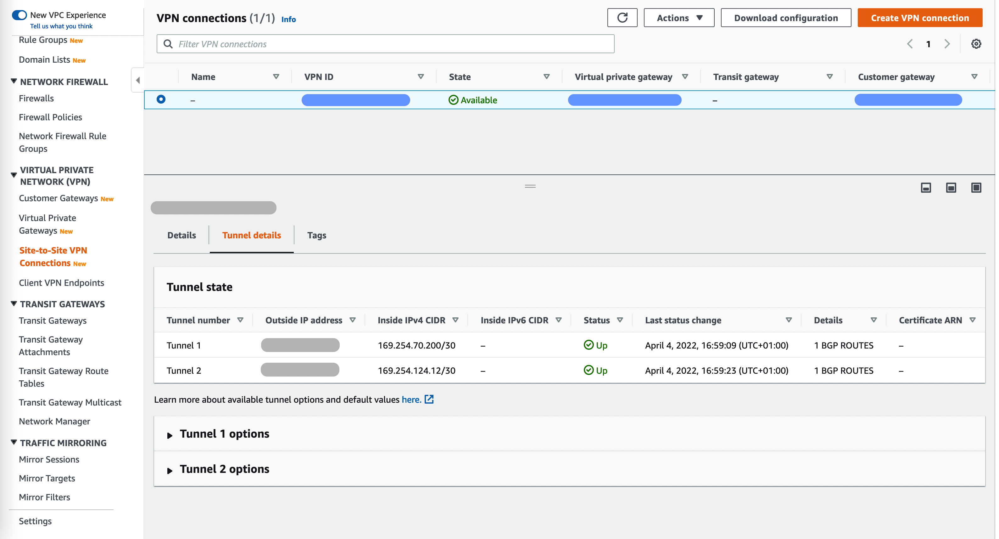
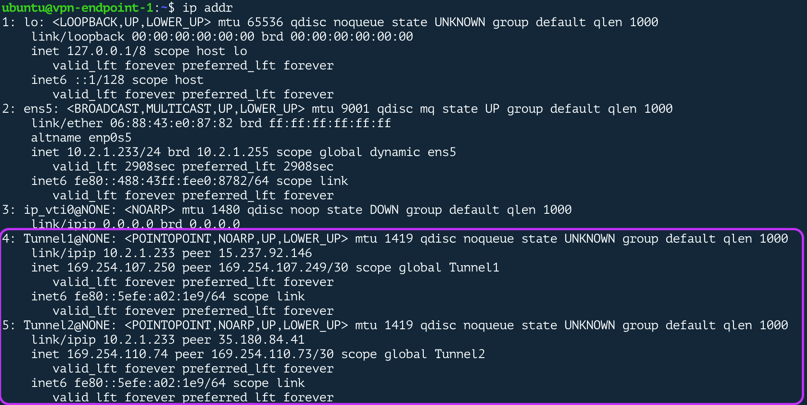
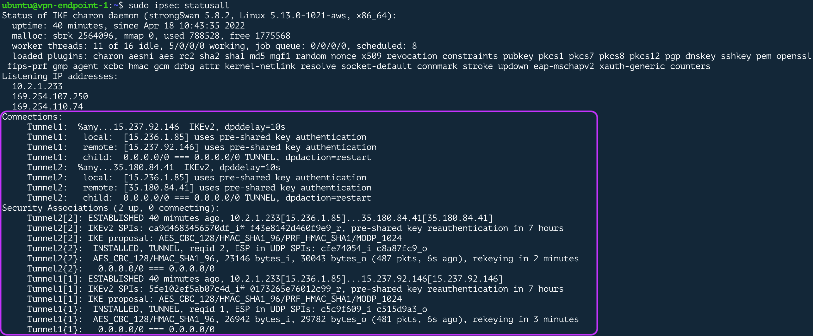
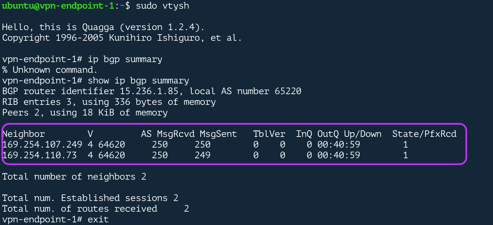
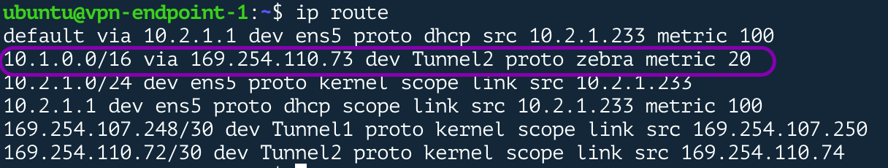
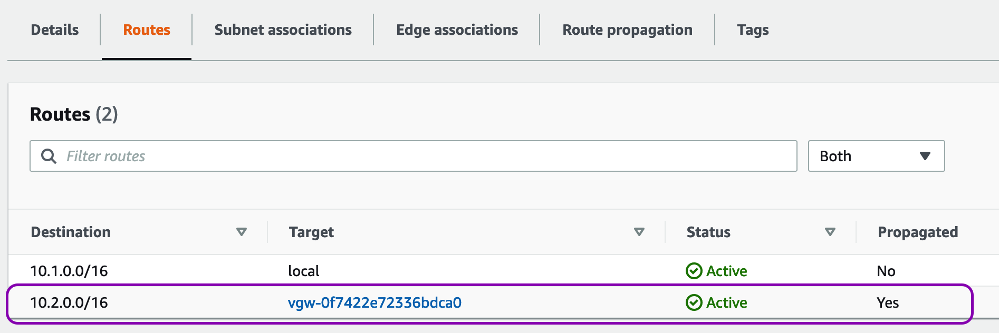
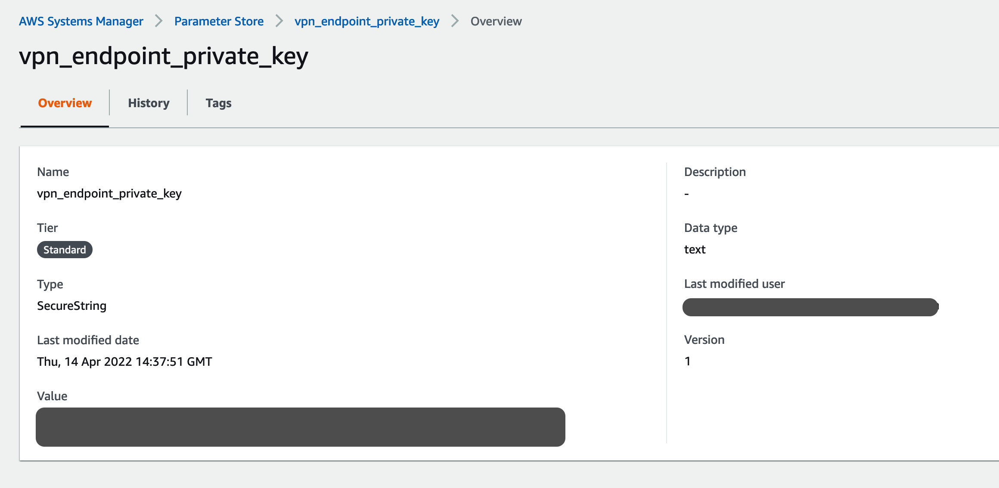

# AWS site-to-site VPN with BGP

This module deploys a secure connection between two AWS VPC's, using the [AWS site-to-site VPN](https://docs.aws.amazon.com/vpn/latest/s2svpn/VPC_VPN.html) service on one end, and a standard Ubuntu 20.04 LTS instance as the Customer Gateway (CGW) on the other end. With this reference setup you can easily test scenarios when you need to expose your VPC services hosted in private networks, to any external network that could be either in a different cloud (Azure, Google cloud or Oracle cloud) or in your own facilities (home, office or data center). 

The setup has two logic sides, the blue represents your AWS VPC where your VPC services are attached to, the green side any external network reachable through the internet. In this setup, the green side is also a VPC in the same account as this is the easiest way for an end-to-end automation. 




## Key Features
#### 1. Deploy a site-to-site VPN connection
Create a self-configured [AWS site-to-site VPN](https://docs.aws.amazon.com/vpn/latest/s2svpn/VPC_VPN.html) between your VPC and a remote location through an IPSec tunnel. 


#### 2. Automate the Customer Gateway configuration
A self-configured EC2 instance (Ubuntu 20.04 LTS) used as a remote-end for the secure connection established using an IPSec tunnel ([Strongswan software](https://www.strongswan.org/)) and a BGP session to advertise prefixes dynamically ([Quagga software](https://www.quagga.net/)).

**Auto-configured Tunnel Interfaces (green)**
The VPN instance has two additional interfaces, one for each IPSec tunnel. These tunnels work in an active/standby model.


**IPSec Up and Running (green)**
IPSec tunnels established successfully.


**BGP connection Established (green)**
BGP sessions established between the two neighbours, routes are being advertised and received.

#### 3. Configure L3 routing
Access your VPC services from a remote network without exposing them to the internet. Advertise routes dynamically using BGP protocol.

**VPN instance routes (green)**
Private networks hosted in the blue side are reachable from the VPN instance through the tunnel interface. 


**AWS private subnet routes (blue)**
Private networks hosted in the green side are reachable through the Virtual Private Gateway (VPG). These routes are propagated from VPG and advertised by BGP. 



### Disclaimer

This module is a reference implementation for testing purposes and is NOT intended for a production environment. By using it you are at your own risk.

For a production setup, I strongly recommend to read [Amazon Virtual Private Cloud Connectivity Options](https://docs.aws.amazon.com/whitepapers/latest/aws-vpc-connectivity-options/welcome.html) from where you can take all the insights you need to design an scalable, highly-available and secure architecture.

## Usage

This module can be deployed without any input parameter by setting the pre-defined values in all input parameters (see inputs docs).
#### Basic setup

```

  module "my_vpn_setup" {

    source  = "aws-terraform-fullyconnectedvpn"
    version = "1.0.5"

    # insert the 12 optional variables

  }
```
#### Access CGW with a self-managed key pair

```

  module "my_vpn_setup" {

    source  = "aws-terraform-fullyconnectedvpn"
    version = "1.0.5"

    green_vpn_inst_keyname              = my-existing-keypair
    green_vpn_inst_allowed_networks_ssh = ["108.34.76.23/32", ...] # SSH sessions will be blocked if source IP is not set

  }
```
#### Customer Gateway with an auto-generated key pair

Do not define the input variable `green_vpn_inst_keyname` if you prefer to have an auto-generated key pair.

```

  module "my_vpn_setup" {

    source  = "aws-terraform-fullyconnectedvpn"
    version = "1.0.5"

    green_vpn_inst_allowed_networks_ssh = ["108.34.76.23/32", ...] # SSH won't be possible if source IP is not set

  }
```
To access the VPN instance, use the private key securely stored in AWS Systems Manager parameter store.



Read this page if you're not familiar on how to [Connect to your Linux instance using SSH](https://docs.aws.amazon.com/AWSEC2/latest/UserGuide/AccessingInstancesLinux.html).

#### Define custom network parameters

```HCL
module "my_vpn_setup" {

    source  = "aws-terraform-fullyconnectedvpn"
    version = "1.0.5"

    # blue side input params
    blue_vpc_cidr               = "172.17.0.0/16" 
    blue_asn                    = "64620"
    blue_public_subnet_size     = 20 
    blue_private_subnet_size    = 20

    # green side input params
    green_vpc_cidr              = "172.16.0.0/16" 
    green_asn                   = "65220"
    green_public_subnet_size    = 24
    green_private_subnet_size   = 24

}
```
This module deploys a public and a private subnets on both sides. The public subnet always uses the first block from VPC address space with the specified size for the public subnet. The private subnet always uses the second block from VPC address space with the specified size for the private subnet.


You can create more subnets using your own resources or modules by attaching them to the blue or green VPC. To get their ids see output documentation.

<!-- BEGIN_TF_DOCS -->
## Requirements

| Name | Version |
|------|---------|
| <a name="requirement_terraform"></a> [terraform](#requirement\_terraform) | >= 1.0.11 |
| <a name="requirement_aws"></a> [aws](#requirement\_aws) | >= 4.5.0 |
| <a name="requirement_tls"></a> [tls](#requirement\_tls) | 3.1.0 |

## Providers

| Name | Version |
|------|---------|
| <a name="provider_aws"></a> [aws](#provider\_aws) | >= 4.5.0 |
| <a name="provider_tls"></a> [tls](#provider\_tls) | 3.1.0 |

## Modules

| Name | Source | Version |
|------|--------|---------|
| <a name="module_blue_vpc"></a> [blue\_vpc](#module\_blue\_vpc) | terraform-aws-modules/vpc/aws | 3.13.0 |
| <a name="module_green_vpc"></a> [green\_vpc](#module\_green\_vpc) | terraform-aws-modules/vpc/aws | 3.13.0 |

## Resources

| Name | Type |
|------|------|
| [aws_eip.green_vpn_inst](https://registry.terraform.io/providers/hashicorp/aws/latest/docs/resources/eip) | resource |
| [aws_eip_association.green_vpn_inst_eip](https://registry.terraform.io/providers/hashicorp/aws/latest/docs/resources/eip_association) | resource |
| [aws_instance.green_vpn_inst](https://registry.terraform.io/providers/hashicorp/aws/latest/docs/resources/instance) | resource |
| [aws_key_pair.green_vpn_inst](https://registry.terraform.io/providers/hashicorp/aws/latest/docs/resources/key_pair) | resource |
| [aws_route.green_blue_side_route](https://registry.terraform.io/providers/hashicorp/aws/latest/docs/resources/route) | resource |
| [aws_security_group.green_vpn_inst_green_traffic](https://registry.terraform.io/providers/hashicorp/aws/latest/docs/resources/security_group) | resource |
| [aws_security_group.green_vpn_inst_ipsec](https://registry.terraform.io/providers/hashicorp/aws/latest/docs/resources/security_group) | resource |
| [aws_security_group.green_vpn_inst_ssh](https://registry.terraform.io/providers/hashicorp/aws/latest/docs/resources/security_group) | resource |
| [aws_ssm_parameter.green_vpn_inst](https://registry.terraform.io/providers/hashicorp/aws/latest/docs/resources/ssm_parameter) | resource |
| [aws_vpn_connection.blue_vpn](https://registry.terraform.io/providers/hashicorp/aws/latest/docs/resources/vpn_connection) | resource |
| [tls_private_key.green_vpn_inst](https://registry.terraform.io/providers/hashicorp/tls/3.1.0/docs/resources/private_key) | resource |
| [aws_ami.green_vpn_inst_ubuntu](https://registry.terraform.io/providers/hashicorp/aws/latest/docs/data-sources/ami) | data source |
| [aws_availability_zones.available](https://registry.terraform.io/providers/hashicorp/aws/latest/docs/data-sources/availability_zones) | data source |

## Inputs

| Name | Description | Type | Default | Required |
|------|-------------|------|---------|:--------:|
| <a name="input_blue_asn"></a> [blue\_asn](#input\_blue\_asn) | (Optional) The BGP Autonomous System Number (ASN) for the blue side. Select an ASN from the private pool 64512 - 65534) | `string` | `"64620"` | no |
| <a name="input_blue_private_subnet_size"></a> [blue\_private\_subnet\_size](#input\_blue\_private\_subnet\_size) | (Optional) Private subnet size for the blue side. This size is a number that defines the subnet mask and can have any value from 16 to 28 as long as it is smaller than VPC size. We recommend to leave the default value If you have limited knowledge in subnetting. | `number` | `24` | no |
| <a name="input_blue_public_subnet_size"></a> [blue\_public\_subnet\_size](#input\_blue\_public\_subnet\_size) | (Optional) Public subnet size for the blue side. This size is a number that defines the subnet mask and can have any value from 16 to 28 as long as it is smaller than VPC size. We recommend to leave the default value If you have limited knowledge in subnetting. | `number` | `24` | no |
| <a name="input_blue_vpc_cidr"></a> [blue\_vpc\_cidr](#input\_blue\_vpc\_cidr) | (Optional) Blue side VPC CIDR. VPC size from /16 to /27. | `string` | `"10.1.0.0/16"` | no |
| <a name="input_green_asn"></a> [green\_asn](#input\_green\_asn) | (Optional) The BGP Autonomous System Number (ASN) for the green side. Select an ASN from the private pool 64512 - 65534) | `string` | `"65220"` | no |
| <a name="input_green_private_subnet_size"></a> [green\_private\_subnet\_size](#input\_green\_private\_subnet\_size) | (Optional) Private subnet size for the green side. This size is a number that defines the subnet mask and can have any value from 16 to 28 as long as it is smaller than VPC size. We recommend to leave the default value If you have limited knowledge in subnetting. | `number` | `24` | no |
| <a name="input_green_public_subnet_size"></a> [green\_public\_subnet\_size](#input\_green\_public\_subnet\_size) | (Optional) Public subnet size for the green side. This size is a number that defines the subnet mask and can have any value from 16 to 28 as long as it is smaller than VPC size. We recommend to leave the default value If you have limited knowledge in subnetting. | `number` | `24` | no |
| <a name="input_green_vpc_cidr"></a> [green\_vpc\_cidr](#input\_green\_vpc\_cidr) | (Optional) Green side VPC CIDR. VPC size from /16 to /27. | `string` | `"10.2.0.0/16"` | no |
| <a name="input_green_vpn_endpoint_instancetype"></a> [green\_vpn\_endpoint\_instancetype](#input\_green\_vpn\_endpoint\_instancetype) | (Optional) The instance type for the VPN EC2 instance used as Customer Gateway (CGW). Make sure you use an instance type that meets you requirements in network performance. | `string` | `"t3a.micro"` | no |
| <a name="input_green_vpn_inst_allowed_networks_ssh"></a> [green\_vpn\_inst\_allowed\_networks\_ssh](#input\_green\_vpn\_inst\_allowed\_networks\_ssh) | (Optional) Allowed networks (CIDR) to SSH to the VPN EC2 instance (green). Eg. 1. Use a single IP [1.1.1.1/32] 2. Use multple IP or networks [1.1.1.1/32, 10.0.1.0/24] | `list(any)` | `[]` | no |
| <a name="input_green_vpn_inst_keyname"></a> [green\_vpn\_inst\_keyname](#input\_green\_vpn\_inst\_keyname) | (Optional) Specify an existing key pair name to associate with the VPN EC2 instance in the green side. This key pair will be used for SSH authentication. If not specified, a new key pair will be created and the private key stored in parameter store. | `string` | `""` | no |
| <a name="input_project_tags"></a> [project\_tags](#input\_project\_tags) | (Optional) A map of convenient tags assigned to all resources. | `string` | `"https://registry.terraform.io/modules/bsrodrigs/fully-connected-vpn/aws/latest"` | no |
| <a name="input_region"></a> [region](#input\_region) | (Optional) AWS region where the module will be deployed (eg. eu-west-1). | `string` | `"eu-west-1"` | no |

## Outputs

| Name | Description |
|------|-------------|
| <a name="output_blue_vpc"></a> [blue\_vpc](#output\_blue\_vpc) | Blue side VPC outputs. For more details see official documentation https://registry.terraform.io/modules/terraform-aws-modules/vpc/aws/latest?tab=outputs |
| <a name="output_green_vpc"></a> [green\_vpc](#output\_green\_vpc) | Green side VPC outputs. For more details see official documentation https://registry.terraform.io/modules/terraform-aws-modules/vpc/aws/latest?tab=outputs |
<!-- END_TF_DOCS -->
